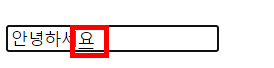

`input` 에 한글 입력시 한글 조합이 끝나지 않았을 때 다른 `input` 을 클릭하는 경우 입력 중이던 `input`로 스크롤이 이동하는 현상이 발생하였다.

한글 입력 시 `composition Event` 가 발생하는데 한글 조합 시작, 종료 시 각각 `compositionstart, compositionend` 이벤트가 발생한다.

아래와 같이 한글 조합이 완료 되지 않은 상태에서 다른 `input`을 클릭하는 경우 입력중이던 `input`에 `compositionend` 이벤트가 발생하면서 스크롤이 이동하게 된다.

> 스크롤 이동을 막으려면 클릭전 한글 조합이 종료 시켜야한다는 결론 !

- `compositionend` 발생 시점에 현재 스크롤 위치의 focus 가능한 요소에 focus하여 한글 조합 종료
- 사용자가 방향키 등을 직접 발생시켜 직접 한글 조합 종료

## 참고

- `compositionend` 이벤트의 `callback`에서 `preventDefault` 제어 불가능..